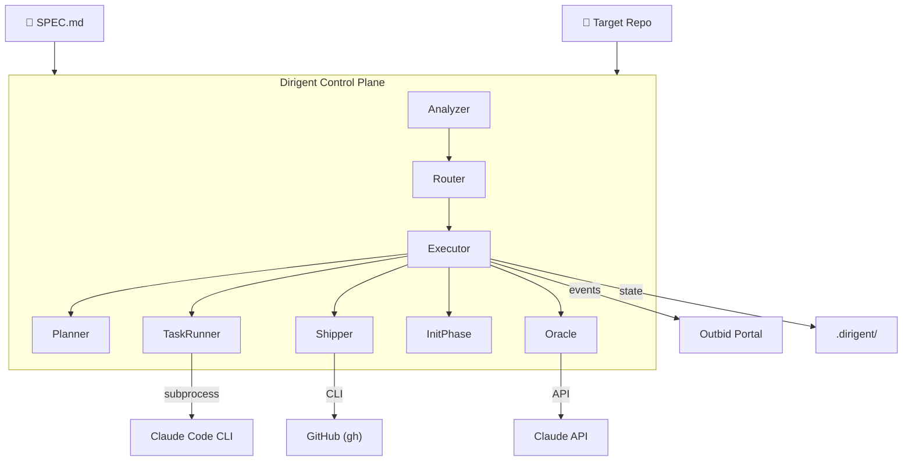
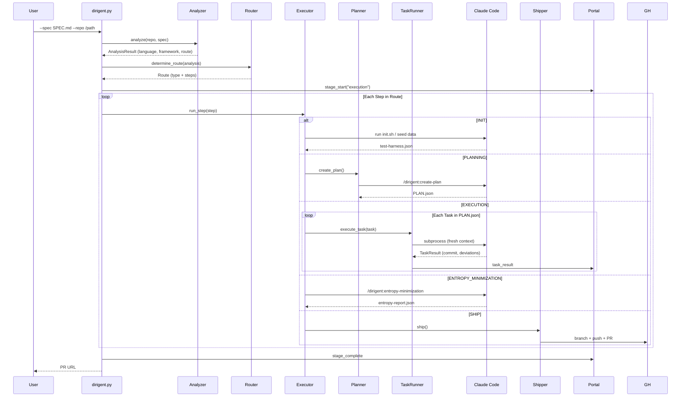
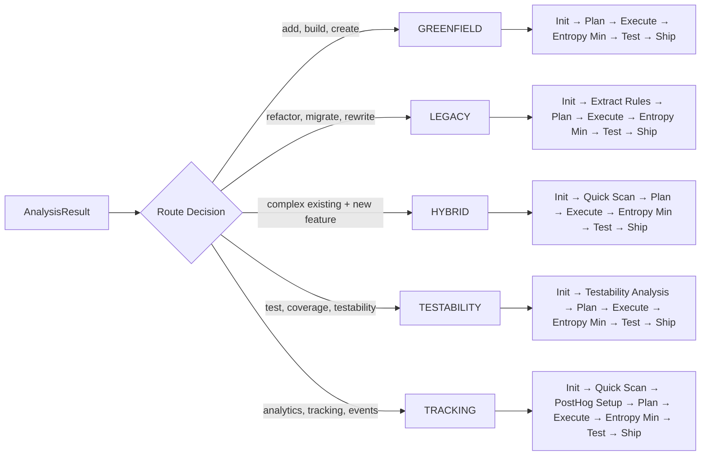
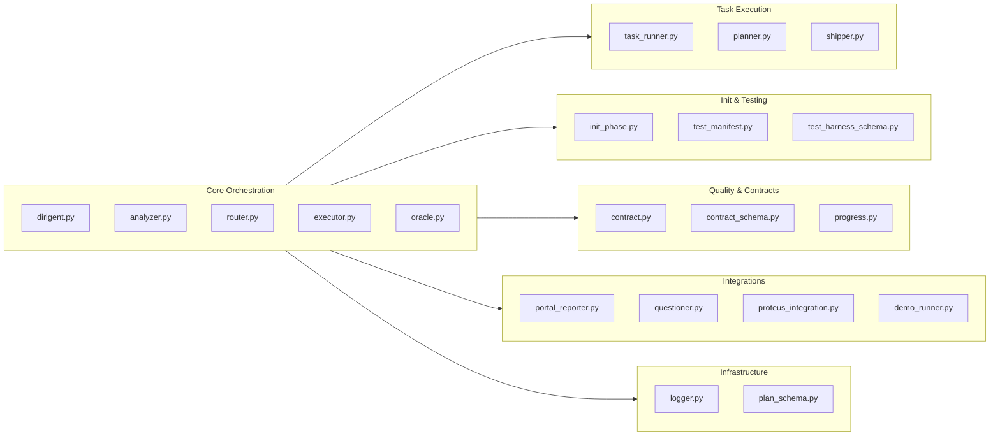
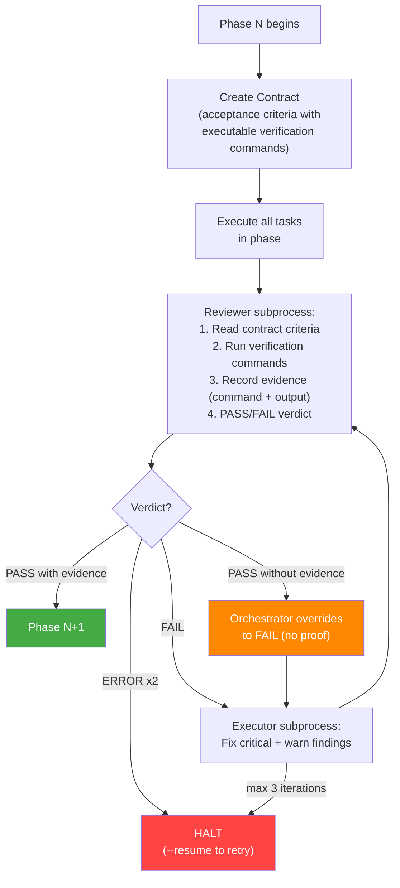
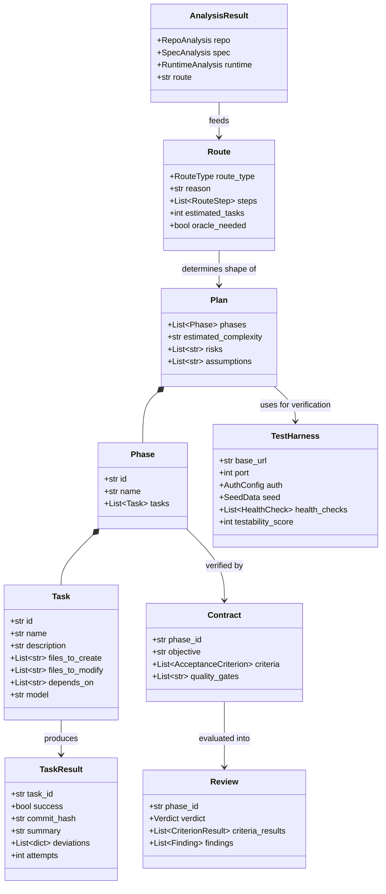
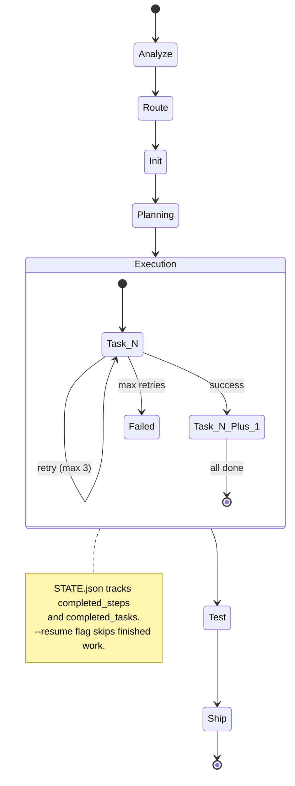

# Outbid Dirigent — Architecture Manifest

> Headless autonomous coding agent controller. Reads a SPEC.md, analyzes the target repo, selects an execution route, creates a phased plan, and runs each task through Claude Code with atomic commits and automatic error recovery.

## System Overview



## Execution Flow



## Route Selection

The Router selects one of five execution routes based on repo analysis and spec keywords:



## Module Architecture



## Contract → Execute → Review Loop

Each phase goes through a strict contract-based verification cycle. The agent cannot declare success without evidence.



**Key enforcement rules:**
- A "pass" verdict without `evidence` (actual command output) on functional criteria is automatically overridden to "fail" by the orchestrator
- Review failure blocks execution — the pipeline halts, not continues
- Unit tests passing alone is NOT sufficient — the contract criterion's verification command must be executed
- The reviewer subprocess runs commands and records `{command, exit_code, stdout_snippet, stderr_snippet}` per criterion

## Data Model



## State & Artifacts

All orchestration state lives in `.dirigent/`:

```
.dirigent/
├── ANALYSIS.json          # Repo + spec analysis
├── ROUTE.json             # Selected route + steps
├── PLAN.json              # Execution plan (phases → tasks)
├── STATE.json             # Progress tracking (resumable)
├── DECISIONS.json         # Oracle decision cache
├── SPEC.md                # Copy of input spec
├── test-harness.json      # Endpoint/auth/seed config
├── BUSINESS_RULES.md      # Extracted rules (Legacy route)
├── CONTEXT.md             # Relevant files (Hybrid route)
├── entropy-report.json    # Entropy minimization results
├── summaries/             # Per-task execution summaries
│   └── {task_id}-SUMMARY.md
├── contracts/             # Phase acceptance criteria
│   └── phase-{id}.json
├── reviews/               # Phase review verdicts
│   └── phase-{id}.json
└── logs/                  # Structured execution logs
    ├── run-*.log
    └── run-*.jsonl
```

## Resume & Recovery



## External Dependencies

| Dependency | Purpose | Required |
|---|---|---|
| **Claude Code CLI** | Task execution engine (subprocess per task) | Yes |
| **Anthropic API** | Oracle architecture decisions | Yes |
| **Git** | Commits, branches, state | Yes |
| **GitHub CLI (gh)** | PR creation | Optional |
| **Outbid Portal** | Real-time event reporting + interactive questions | Optional |
| **Proteus** | Deep domain extraction (5-phase) | Optional |
| **Docker** | Service orchestration for tests | Optional |

## Plugin Skills (19 skills, 18 commands)

The Claude Code plugin (`plugin/.claude-plugin/`) provides skills invoked during execution:

| Skill | Caller | Purpose |
|---|---|---|
| `/dirigent:create-plan` | Planner | Generate PLAN.json from spec + repo context |
| `/dirigent:create-contract` | Contract system | Define phase acceptance criteria |
| `/dirigent:review-phase` | Contract system | Evaluate phase against contract |
| `/dirigent:fix-review` | Contract system | Fix review findings |
| `/dirigent:extract-business-rules` | Executor (Legacy) | Extract business rules from codebase |
| `/dirigent:quick-scan` | Executor (Hybrid/Tracking) | Scan relevant files for context |
| `/dirigent:run-init` | InitPhase | Bootstrap environment + test harness |
| `/dirigent:execute-task` | TaskRunner | Behavioral rules for task execution |
| `/dirigent:increase-testability` | Testability route | Improve test coverage score |
| `/dirigent:add-posthog` | Tracking route | Add PostHog analytics events |
| `/dirigent:build-manifest` | Testability route | Generate outbid-test-manifest.yaml |
| `/dirigent:validate-manifest` | Testability route | Validate manifest against schema |
| `/dirigent:show-plan` | User (CLI) | Render plan for user |
| `/dirigent:show-progress` | User (CLI) | Render execution progress |
| `/dirigent:find-edits` | Research | Find file changes from sessions |
| `/dirigent:find-errors` | Recovery | Surface errors from sessions |
| `/dirigent:search-memories` | Research | Search previous session logs |
| `/dirigent:query-data` | Research | Run DuckDB queries on data files |
| `/dirigent:entropy-minimization` | Executor (all routes) | Align docs, remove dead code, resolve contradictions |

## Key Design Decisions

1. **Subprocess isolation** — Each task runs in a fresh Claude Code process to prevent context window pollution and enable clean retries.

2. **Route-based orchestration** — Analysis-driven route selection adapts the pipeline to the nature of the work (new feature vs. migration vs. test improvement).

3. **Oracle pattern** — Architecture questions are answered via Claude API and cached, enabling fully headless operation without human input.

4. **Evidence-based verification** — Acceptance criteria are defined before execution with executable verification commands. The reviewer must run each command and record output as evidence. The orchestrator rejects "pass" verdicts that lack evidence, and review failure halts the pipeline. Unit tests alone cannot satisfy a criterion — e2e proof is required.

5. **Resumable state machine** — STATE.json tracks every completed step and task, allowing recovery from crashes, timeouts, or network failures.
