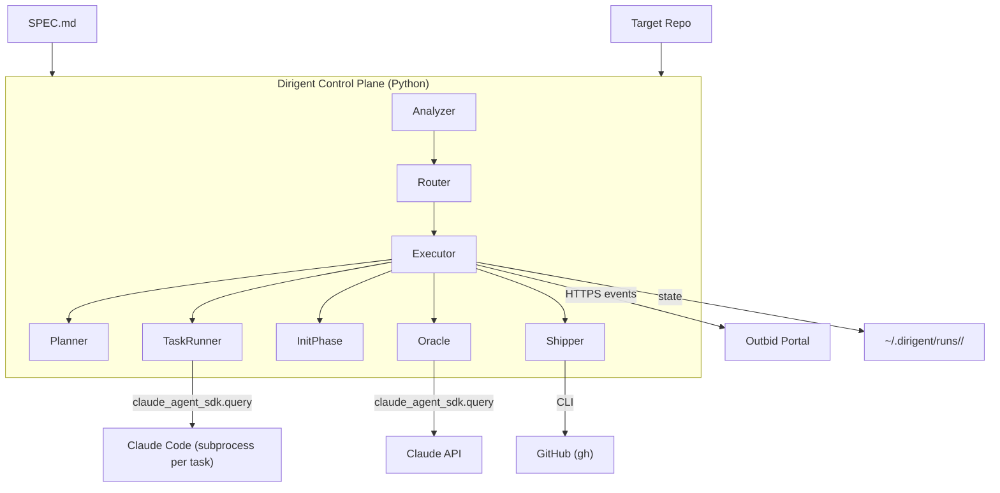
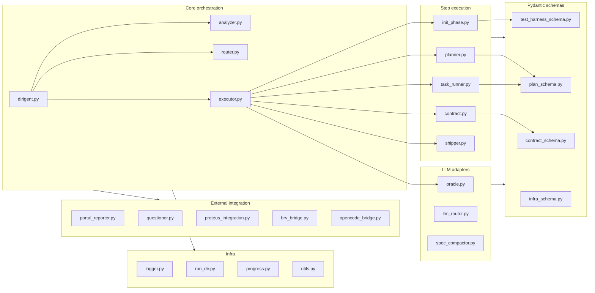
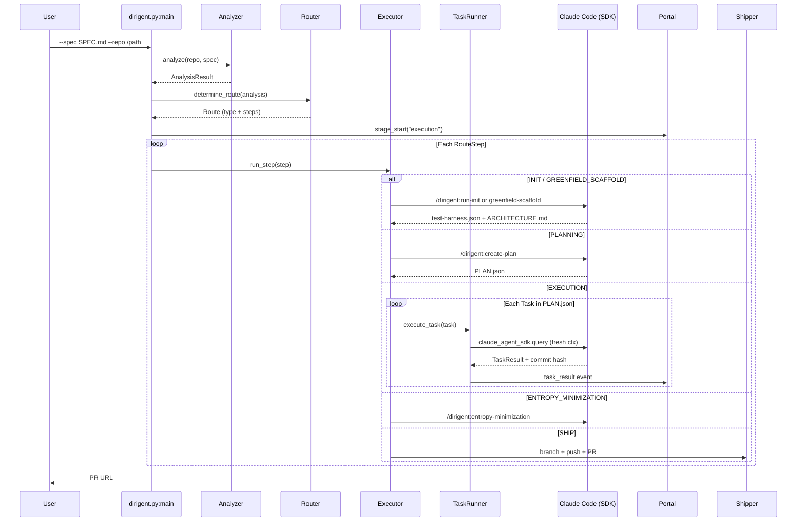
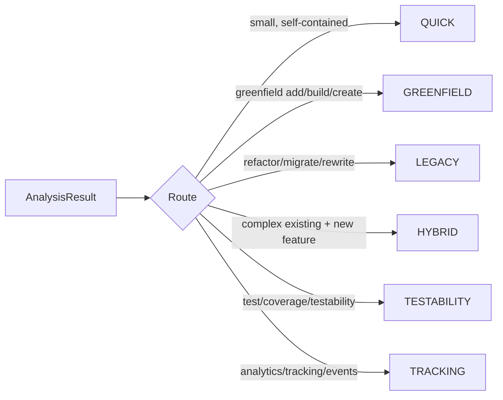
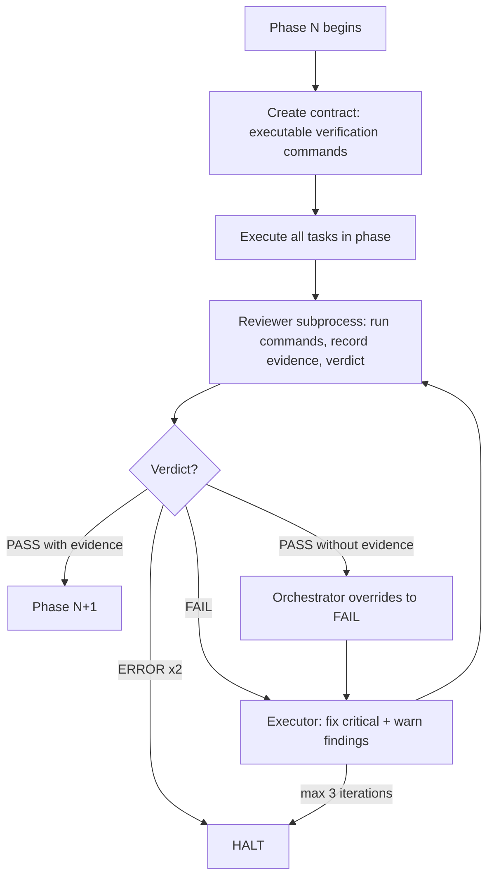
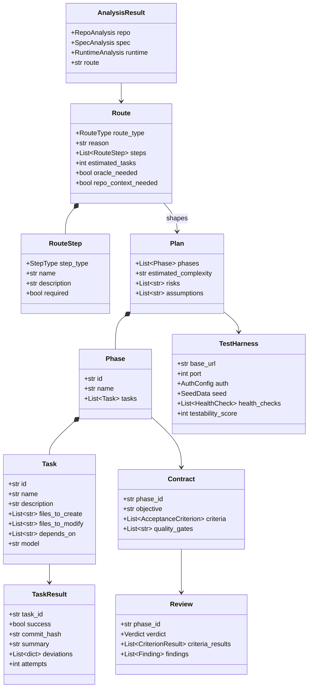

# Outbid Dirigent — Architecture

> Headless autonomous coding agent controller. Reads a SPEC.md, analyzes a target repo, selects an execution route, creates a phased plan, and runs each task through Claude Code with atomic commits, evidence-based phase review, and automatic recovery.



## Testing & Verification

### Build

```bash
uv build                                    # produces wheel + sdist
```
[source: `pyproject.toml:27-29`, build hook `hatch_build.py:1`]

### Test Suite

```bash
pytest tests/ -v --tb=short
```
[source: `.github/workflows/tests.yml:29`, `pyproject.toml:84-88`]

Tests live in `tests/` and cover:
- Unit + integration for router, analyzer, planner, contracts, plan schema, oracle.
- Smoke tests (`tests/test_smoke.py`, `tests/test_greenfield_smoke.py`, `tests/test_e2e.py`).
- A fake Claude subprocess (`tests/fake_claude.py`) stands in for the real `claude` CLI during executor integration tests.

Tests do NOT exercise a real Claude API — the oracle and task_runner paths are stubbed or skipped unless run in `tests/integration/`.

### E2E Tests

```bash
pytest tests/test_e2e.py -v
```
[source: `tests/test_e2e.py:1`]

Runs the full CLI against a scratch repo using the fake Claude harness. No external services required.

### Dev Server

Not applicable — Dirigent is a CLI binary, not a long-running service. Run it directly:

```bash
dirigent --spec SPEC.md --repo /path/to/target
```
[source: `pyproject.toml:16-17` (entry point), `src/outbid_dirigent/dirigent.py:589` (`main()`)]

### How to Verify Manually

1. `uv sync` in repo root.
2. `uv run dirigent --version` — should print `outbid-dirigent 2.0.0` [source: `pyproject.toml:3`].
3. Create a scratch directory with a `SPEC.md` and a git-initialized target repo.
4. `uv run dirigent --spec SPEC.md --repo /tmp/scratch-repo --dry-run` — should analyze and print a route without mutating the repo [source: `src/outbid_dirigent/dirigent.py:651-655`].
5. Without `--dry-run`, the run writes artifacts to `~/.dirigent/runs/<run-id>/` and a small pointer manifest to `/tmp/scratch-repo/.dirigent/manifest.json` [source: `src/outbid_dirigent/run_dir.py:1`].

## Tech Stack

| Layer | Technology | Source |
|-------|-----------|--------|
| Language | Python >= 3.10 | `pyproject.toml:7` |
| Agent SDK | `claude-agent-sdk >= 0.1.58` (task execution, oracle, spec compactor) | `pyproject.toml:13` |
| Validation | Pydantic v2 | `pyproject.toml:10` |
| Logging | Loguru + custom structured logger | `pyproject.toml:11`, `src/outbid_dirigent/logger.py:1` |
| HTTP | `requests` (portal reporter) | `pyproject.toml:9` |
| Config parsing | PyYAML | `pyproject.toml:12` |
| Build backend | Hatchling with custom commit-hash build hook | `pyproject.toml:27-29`, `hatch_build.py:1` |
| Package/dep manager | `uv` (lockfile committed) | `uv.lock` |
| Tests | pytest + pytest-cov + pytest-timeout | `pyproject.toml:22-25` |
| Version bumping | bump-my-version | `pyproject.toml:47-64` |

## Directory Structure

```
outbid-dirigent/
├── src/outbid_dirigent/       # Python package (control plane)
│   ├── dirigent.py            # CLI entry point — argparse + orchestration
│   ├── analyzer.py            # Repo + spec analysis
│   ├── router.py              # Route + step definitions (6 routes, 10 step types)
│   ├── executor.py            # Top-level step runner
│   ├── planner.py             # Thin wrapper — delegates to /dirigent:create-plan
│   ├── task_runner.py         # Runs one task in a fresh Claude Code subprocess
│   ├── init_phase.py          # Init step — test-harness + ARCHITECTURE.md bootstrap
│   ├── oracle.py              # Claude API architecture-decision cache
│   ├── contract.py            # Phase acceptance criteria + review loop
│   ├── shipper.py             # Branch, push, PR
│   ├── spec_compactor.py      # Shrink large SPECs via LLM
│   ├── portal_reporter.py     # HTTPS events to Outbid Portal
│   ├── questioner.py          # Interactive/portal/dummy question adapter
│   ├── proteus_integration.py # Optional Proteus legacy-rule extraction
│   ├── brv_bridge.py          # ByteRover knowledge bridge
│   ├── opencode_bridge.py     # Optional OpenCode engine
│   ├── demo_runner.py         # --demo mode: simulate events
│   ├── run_dir.py             # ~/.dirigent/runs/<id>/ scaffolding
│   ├── logger.py              # Structured logger (JSONL + stdout)
│   ├── llm_router.py          # LLM-based route selection
│   ├── {plan,contract,test_harness,infra}_schema.py  # Pydantic schemas
│   ├── progress.py            # Live progress rendering
│   ├── utils.py               # Shared helpers
│   └── plugin/                # Claude Code plugin (shipped inside the wheel)
│       ├── .claude-plugin/plugin.json   # Plugin manifest
│       ├── skills/            # 18 skills invoked by subprocesses
│       ├── commands/          # 4 user-facing slash commands
│       ├── agents/            # 8 subagent prompts
│       ├── hooks/             # statusline + PreToolUse hooks
│       ├── mcp/               # dirigent-state MCP server
│       └── scripts/           # validate_contract.py, validate_review.py
├── tests/                     # pytest suite + fake_claude harness
├── harness-docs/              # Portfolio engineering standards + templates
├── docs/                      # User-facing docs
├── example/, example-specs/   # Example specs and repos
├── .github/workflows/         # ci.yml, tests.yml, integration-tests.yml, release.yml
├── install.sh                 # curl-pipe-sh installer
├── hatch_build.py             # Bakes git commit hash into the wheel
├── pyproject.toml             # uv/hatchling project config
├── README.md                  # User docs
├── SPEC.md                    # Dirigent's own spec (dogfooding)
└── CLAUDE.md                  # Portfolio engineering standards for this repo
```

Top-level counts verified via `ls`: 28 Python modules in `src/outbid_dirigent/`, 18 skill directories in `src/outbid_dirigent/plugin/skills/`, 4 command files in `src/outbid_dirigent/plugin/commands/`, 8 agent prompts in `src/outbid_dirigent/plugin/agents/`.

## Entry Points

| Trigger | Code | Purpose |
|---------|------|---------|
| CLI `dirigent` (console script) | `src/outbid_dirigent/dirigent.py:589` (`main`) | Full run: analyze → route → execute → ship |
| CLI `dirigent --polish` | `src/outbid_dirigent/dirigent.py:721-725` | Stateless spec→code gap audit |
| CLI `dirigent --plan-only` | `src/outbid_dirigent/dirigent.py:715-719` | Stop after plan generation |
| CLI `dirigent --resume` | `src/outbid_dirigent/dirigent.py:657-661` | Continue from `STATE.json` |
| CLI `dirigent --demo` | `src/outbid_dirigent/dirigent.py:782-786` | Send simulated portal events |
| MCP server `dirigent-state` | `src/outbid_dirigent/plugin/mcp/dirigent_state_server.py:1` | In-Claude-Code MCP: `dirigent_show_plan`, `dirigent_status` |
| Hook `dirigent-hook.sh` | `src/outbid_dirigent/plugin/hooks/dirigent-hook.sh:1` | Claude Code PreToolUse / statusline integration |
| Installer | `install.sh:1` | `curl \| sh` install via uv, registers Claude Code plugin |

## Module Architecture


[sources: `src/outbid_dirigent/dirigent.py:24-30` (imports), `src/outbid_dirigent/task_runner.py:10-34`, `src/outbid_dirigent/executor.py`]

### Execution flow


[source: `src/outbid_dirigent/router.py:29-40` (StepType), `src/outbid_dirigent/executor.py`]

### Route selection

Six routes, each a fixed sequence of `RouteStep`s defined in `router.py`.


[source: `src/outbid_dirigent/router.py:20-26` (`RouteType`), `src/outbid_dirigent/router.py:84-336` (step lists)]

### Contract → Execute → Review loop

Phase verification is evidence-gated.


[source: `src/outbid_dirigent/contract.py:1`, `src/outbid_dirigent/contract_schema.py:1`, validators in `src/outbid_dirigent/plugin/scripts/validate_contract.py:1` and `validate_review.py:1`]

## Data Model



No database — all state is filesystem JSON. Run artifacts live in `~/.dirigent/runs/<run-id>/`:

```
ANALYSIS.json          # Repo + spec analysis          [analyzer.py]
ROUTE.json             # Selected route + steps        [router.py]
PLAN.json              # Execution plan                [plan_schema.py]
STATE.json             # Progress, resumable           [router.py:74 StateRecord]
DECISIONS.json         # Oracle decision cache         [oracle.py:52]
SPEC.md                # Copy of input spec
test-harness.json      # Endpoint/auth/seed config     [test_harness_schema.py]
BUSINESS_RULES.md      # Legacy route only
CONTEXT.md             # Hybrid route only
entropy-report.json    # Entropy minimization output
summaries/             # Per-task SUMMARY.md files
contracts/phase-<id>.json
reviews/phase-<id>.json
logs/run-*.log, run-*.jsonl
```

The target repo itself only contains `<repo>/.dirigent/manifest.json` — a pointer to the run dir. [source: `src/outbid_dirigent/run_dir.py:1`]

## Key Patterns

- **Subprocess isolation per task.** Each `Task` is handed to a fresh `claude_agent_sdk.query(...)` call — no shared context, clean retries on failure. [source: `src/outbid_dirigent/task_runner.py:20` (SDK import), `task_runner.py:418-505` (`subprocess.run` fallbacks)]
- **Route-based orchestration.** `Router.determine_route(analysis)` selects one of six routes (`QUICK | GREENFIELD | LEGACY | HYBRID | TESTABILITY | TRACKING`); each route is a fixed list of `RouteStep`s. [source: `src/outbid_dirigent/router.py:20-26`, `router.py:84-336`]
- **Oracle caching.** Architectural questions go to Claude API via `claude_agent_sdk.query`, results cached in `DECISIONS.json` keyed by question hash — no duplicate spend on resume. [source: `src/outbid_dirigent/oracle.py:39-60`]
- **Evidence-based phase review.** Every phase has a `Contract` with executable verification commands; a reviewer subprocess must run each and attach `{command, exit_code, stdout_snippet, stderr_snippet}` — a "pass" verdict without evidence is auto-overridden to "fail". [source: `src/outbid_dirigent/plugin/scripts/validate_review.py:1`, `src/outbid_dirigent/contract.py:1`]
- **Resumable state machine.** `STATE.json` tracks `completed_steps` and per-task progress; `--resume` skips finished work. [source: `src/outbid_dirigent/router.py:74-77` (`StateRecord`), `src/outbid_dirigent/dirigent.py:657-661`]
- **Pydantic at every boundary.** JSON artifacts (`Route`, `Plan`, `Contract`, `Review`, `TestHarness`) are Pydantic models — the control plane refuses malformed subprocess output instead of guessing. [source: `plan_schema.py`, `contract_schema.py`, `test_harness_schema.py`, `infra_schema.py`]
- **Structured logging to JSONL.** `DirigentLogger` writes both human-readable stdout and newline-delimited JSON to `logs/run-*.jsonl`. [source: `src/outbid_dirigent/logger.py:1-50`]

## API Surface

This is a CLI, not an HTTP service. The surface is the `dirigent` command-line.

| Flag | Purpose | Source |
|------|---------|--------|
| `--spec PATH` | Path to SPEC.md (or `-`/`.` for stdin) | `dirigent.py:626-630` |
| `--repo PATH` | Target repository (required) | `dirigent.py:632-636` |
| `description` (positional) | Inline spec text; generates SPEC.md via `/dirigent:generate-spec` | `dirigent.py:620-624` |
| `--yolo` | Skip clarifying questions | `dirigent.py:638-642` |
| `--phase {analyze,execute,ship,all}` | Run a single phase | `dirigent.py:644-649` |
| `--dry-run` | Analyze only, no mutations | `dirigent.py:651-655` |
| `--resume` | Continue interrupted run | `dirigent.py:657-661` |
| `--force` | Ignore analysis cache | `dirigent.py:663-667` |
| `--use-proteus` | Deep Proteus domain extraction (legacy) | `dirigent.py:682-686` |
| `--route {quick,greenfield,legacy,hybrid,testability,tracking}` | Manual route override | `dirigent.py:688-693` |
| `--force-continue` | Proceed past failed phase review | `dirigent.py:695-699` |
| `--output json` | Emit `@@JSON@@`-prefixed JSONL on stdout | `dirigent.py:701-706` |
| `--execution-mode {autonomous,plan_first,interactive}` | Question handling | `dirigent.py:708-713` |
| `--plan-only` | Stop after PLAN.json | `dirigent.py:715-719` |
| `--polish` / `--polish-max-fixes N` | Stateless spec→code gap audit | `dirigent.py:721-732` |
| `--question-timeout M` | Minutes to wait on interactive questions | `dirigent.py:740-745` |
| `--model` / `--effort` | Model + thinking effort for tasks | `dirigent.py:747-759` |
| `--portal-url` / `--execution-id` / `--reporter-token` | Portal integration | `dirigent.py:761-780` |
| `--demo` / `--demo-speed` | Simulated event playback | `dirigent.py:782-793` |

### Plugin surface (inside Claude Code)

The `plugin/` directory ships as a Claude Code plugin. Counts verified against `plugin/skills/` and `plugin/commands/`:

| Kind | Count | Source |
|------|-------|--------|
| Skills | 18 (e.g. `create-plan`, `implement-task`, `greenfield-scaffold`, `entropy-minimization`, `generate-architecture`, `polish`, `quick-scan`, `quick-feature`, `build-plugin`, `add-posthog`, `increase-testability`, `extract-business-rules`, `generate-spec`, `run-init`, `query-brv`, `query-data`, `search-memories`, `hi`) | `src/outbid_dirigent/plugin/skills/` |
| Commands | 4 (`hi.md`, `start.md`, `show-plan.md`, `show-progress.md`) | `src/outbid_dirigent/plugin/commands/` |
| Subagents | 8 (`codebase-mapper`, `contract-negotiator`, `doc-cleaner`, `implementer`, `infra-architect`, `plugin-writer`, `reviewer`, `spec-writer`) | `src/outbid_dirigent/plugin/agents/` |
| MCP server | `dirigent-state` (tools: `dirigent_show_plan`, `dirigent_status`) | `src/outbid_dirigent/plugin/mcp/dirigent_state_server.py:1`, `plugin.json:9-13` |

## Configuration

| Variable | Purpose | Required | Source |
|----------|---------|----------|--------|
| `PORTAL_URL` | Outbid Portal base URL (default `https://outbid-portal.vercel.app`) | No | `src/outbid_dirigent/dirigent.py:764` |
| `EXECUTION_ID` | Correlates this run with a Portal execution | Only when using Portal | `src/outbid_dirigent/dirigent.py:771` |
| `REPORTER_TOKEN` | Bearer token for Portal events | Only when using Portal | `src/outbid_dirigent/dirigent.py:778` |
| `ANTHROPIC_API_KEY` | Read by `claude-agent-sdk` for Oracle + spec compactor + task execution | Yes (for any LLM step) | consumed by `claude_agent_sdk`; referenced in plugin stacks e.g. `plugin/skills/greenfield-scaffold/stacks/anthropic-sdk.md:145-149` |
| `CLAUDE_PROJECT_DIR` | Resolved by MCP state server to locate `.dirigent/` | No (falls back to cwd) | `src/outbid_dirigent/plugin/mcp/dirigent_state_server.py:56` |
| `DIRIGENT_VERSION` | Installer: git ref to install | No (default `main`) | `install.sh:11` |
| `DIRIGENT_INSTALL_UV` | Installer: `1` to auto-install uv | No | `install.sh:12` |
| `DIRIGENT_NO_PLUGIN` | Installer: `1` to skip Claude Code plugin registration | No | `install.sh:13` |

There is no `.env.example` — configuration is either CLI flags or runtime env vars read directly.

## External Dependencies

| Service | Purpose | Failure Mode |
|---------|---------|-------------|
| Claude Code CLI / `claude-agent-sdk` | Task execution engine (subprocess per task) | Hard fail — pipeline halts |
| Anthropic API | Oracle decisions, spec compaction, LLM routing | Hard fail on Oracle path; other paths degrade |
| Git | All commits, branching, state detection | Hard fail — Dirigent refuses to run in non-git repo |
| GitHub CLI (`gh`) | PR creation in Shipper step | Graceful degrade — branch pushed, PR skipped |
| Outbid Portal | Real-time event reporting + interactive questions | Graceful degrade — runs headless without it |
| Proteus | Deep domain/field/rule extraction (Legacy route with `--use-proteus`) | Optional — Legacy route still runs without it, with shallower extraction |
| OpenCode | Alternative execution engine (`opencode_bridge.py`) | Optional |
| ByteRover | Knowledge bridge (`brv_bridge.py`) | Optional |
| Docker | Service orchestration for some test harnesses | Optional — only used when test-harness.json requests it |

## Architecture Decisions

- **Subprocess-per-task, not a long-running agent session.** Fresh Claude Code process per `Task` prevents context-window pollution and makes retries + resume clean. [source: `src/outbid_dirigent/task_runner.py`, imports at `task_runner.py:10-34`]
- **Route-first, plan-second.** The Router picks a route shape (QUICK / GREENFIELD / LEGACY / HYBRID / TESTABILITY / TRACKING) before the planner generates phases/tasks, so the pipeline is appropriate to the work type. [source: `src/outbid_dirigent/router.py:20-26`, step lists `router.py:84-336`]
- **Evidence-gated phase review.** A "pass" verdict must carry actual command output or the orchestrator overrides it to "fail". Unit tests alone are never sufficient. [source: `src/outbid_dirigent/plugin/scripts/validate_review.py:1`, `contract.py:1`]
- **Artifacts outside the target repo.** Run state goes to `~/.dirigent/runs/<id>/`; the target repo only gets a pointer `manifest.json`. Keeps debug/planning dirs out of PRs. [source: `src/outbid_dirigent/run_dir.py:1`]
- **Pydantic at every subprocess boundary.** Subprocess output is parsed into typed models; malformed output fails loud instead of silently polluting downstream state. [source: `plan_schema.py`, `contract_schema.py`, `test_harness_schema.py`, `infra_schema.py`, `router.py:63-77`]
- **Oracle via SDK, task execution via SDK.** Unified on `claude-agent-sdk` (not the raw Anthropic SDK) — same auth, same interface, easier migration between model versions. [source: `pyproject.toml:13`, `src/outbid_dirigent/oracle.py:17-18`, `src/outbid_dirigent/task_runner.py:20`]
- **Resumable state machine over idempotent re-runs.** `STATE.json` tracks `completed_steps` + per-task progress; `--resume` skips finished work rather than re-running it. [source: `src/outbid_dirigent/router.py:74-77`]
- **Commit hash baked at build time.** `hatch_build.py` writes `_build_info.COMMIT` into wheels so `dirigent --version` always reports the actual code running, not just the package version. [source: `hatch_build.py:1`, `src/outbid_dirigent/dirigent.py:70-100`]

## Development Workflow

```bash
# Setup (uv is the supported toolchain)
uv sync                                     # install deps + dev extras

# Run against a target repo
uv run dirigent --spec SPEC.md --repo /path/to/target
uv run dirigent --repo . "add a dark mode toggle"   # inline description
uv run dirigent --spec SPEC.md --repo /path --dry-run
uv run dirigent --spec SPEC.md --repo /path --resume

# Test
uv run pytest tests/ -v --tb=short
uv run pytest tests/test_e2e.py -v          # e2e with fake-claude harness

# Version bump (manual bumps also validated by CI)
uv run bump-my-version bump patch           # or minor / major

# Build
uv build                                    # wheel + sdist into dist/

# Install from source as a tool (what install.sh does under the hood)
uv tool install .                           # then `dirigent --version`
```
[sources: `pyproject.toml:16-25`, `.github/workflows/tests.yml:29`, `.github/workflows/ci.yml:1`, `install.sh:1`]
